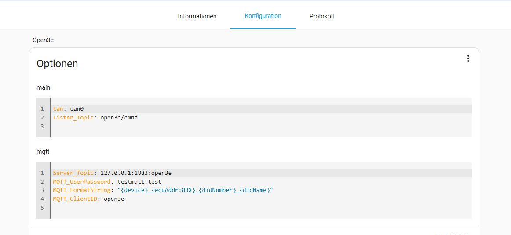

# open3e-ha-addon
Home Assistnat Add-on Open3e

!!! First Beta Release !!! Use at your own risk. 

This Add-on connects to a USB Can adapter which is plugged into the Home Assistant device. It runs the Open3e https://github.com/open3e/open3e Can to Mqtt application to read and potentially write to Viessmann E3 platform devices (Heat Pump, Venting System, Solar Inverter etc.)

It requires the Mosquitto MQTT broker to be installed in Home Assistant. It will use the Home Assistant build in capability to publish and subscribe to the MQTT Broker the data comming from the CAN adapter. 

On the configuration the username and passwort for a user in your Home Assistant installation must be set otherwise it will fail connecting to MQTT. 

Please note that Add-ons only work on HAOS and Supervised installations see: https://www.home-assistant.io/installation/ 